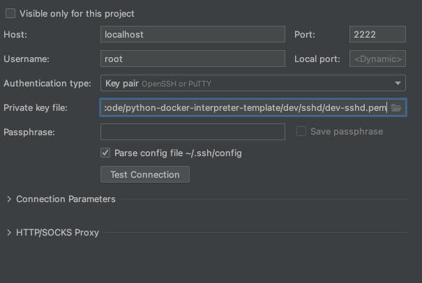
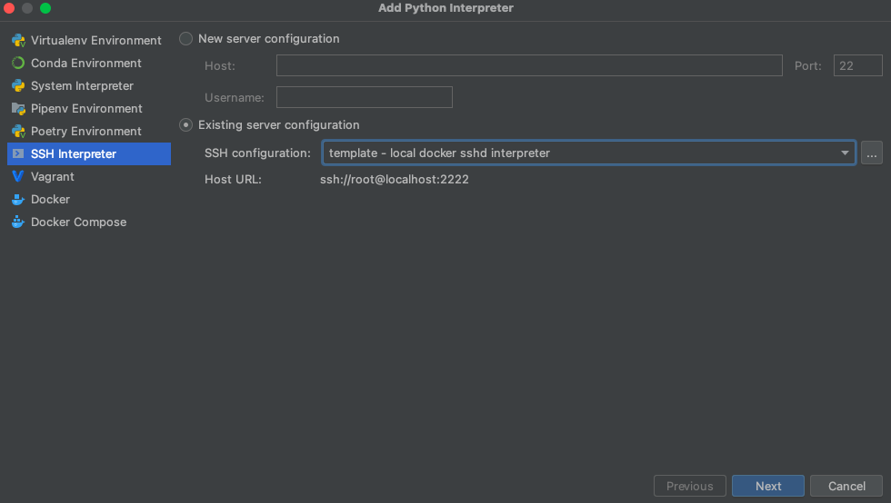
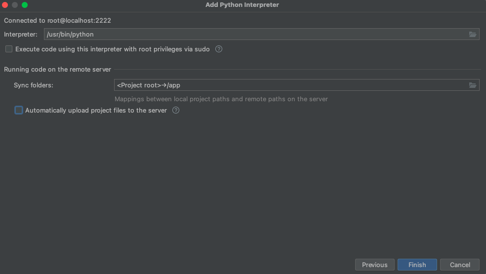

# PyCharm Local Docker Interpreter Project Template

This template can be copied to create a project that uses docker for its local interpreter, avoiding the need for 
endless `venv` directories and installing packages to your local dev system.

**Use of this repo requires PyCharm Professional** because the community version does not support SSH interpreters.

With this template you get full debugging support and PyCharm behaves as if you were using a local `venv` interpreter.

### Dev Setup

1. Go to `./dev/vars.sh` and adjust the `LOCAL_DOCKER_SSH_PORT` variable so that this project's ssh port does not 
   conflict with other projects you may have setup previously.
2. RUN `./dev/sshd/create-keys.sh` to create the local ssh keys. You should store these in git for all members of 
   the project.
3. Run `./dev/d-pyc.sh` to build and start the local docker interpreter.
4. Configure pycharm to use this ssh interpreter:

    1. Create an SSH configuration in Pycharm.
       - Open: Preferences (cmd/ctrl+,) -> Tools -> SSH Configurations
       - Add a new SSH Configuration and set the settings:
         - Host = localhost
         - Port = 2222 (or whatever you set LOCAL_DOCKER_SSH_PORT to)
         - User = root
         - Authentication Type = Key Pair
         - Private key file: browse to this repo `./dev/sshd/dev-sshd.pem`
         - Ensure Unchecked: Visible for only this project
         - Press the "Test Connection" button and it should succeed.

           

    2. Create an SSH interpreter in Pycharm using the SSH configuration.
       - Open: Preferences (cmd/ctrl+,) -> Project -> Project Interpreter
       - Click the cog icon on the right and press "Add".
       - Select "SSH Interpreter" and configure it to use the existing SSH configuration we just created. Press Next.
       
         
       
       - Change the remote path mapping to `/app` and uncheck automatic uploads. Press Finish.
       
         
       
    3. The interpreter setup is complete.
   
5. Whenever you need new pip packages:
   1. Add the package to the `requirements.txt` file at the project root.
   2. Re-run `./dev/d-pyc.sh` and it will rebuild the environment with the new packages.
      - Alternatively, Pycharm may prompt you to install the package automatically, this is better for usual work flow.
   3. If you want updated autocomplete, restart Pycharm. (Autocomplete should update on its own if Pycharm installed 
      the package for you.)

### Dev scripts

`dev/d-exec.sh`

This script is used to execute arbitrary commands inside a separate dev environment container. For example 
`./dev/d-exec.sh python3 -m main` would execute the script `main.py` located at the repo root.

In most cases you would instead use a PyCharm run configuration to run your code inside the main interpreter container. 

